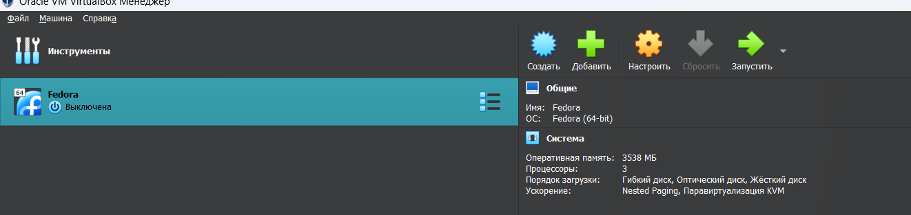
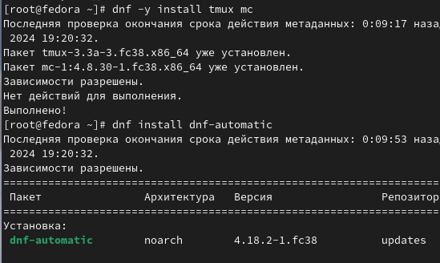
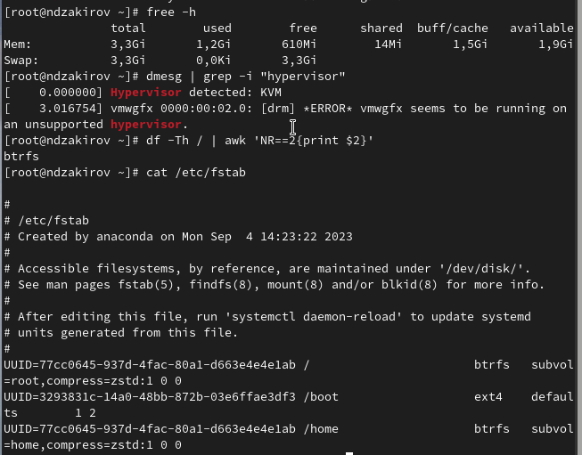

---
## Front matter
lang: ru-RU
title: Лабораторная работа №1
subtitle: Операционные системы
author:
  - Закиров Н.Д., НКАбд-03-23
institute:
  - Российский университет дружбы народов, Москва, Россия
date: 26 февраля 2024

## i18n babel
babel-lang: russian
babel-otherlangs: english
## Formatting pdf
toc: false
toc-title: Содержание
slide_level: 2
aspectratio: 169
section-titles: true
theme: metropolis
header-includes:
 - \metroset{progressbar=frametitle,sectionpage=progressbar,numbering=fraction}
 - '\makeatletter'
 - '\beamer@ignorenonframefalse'
 - '\makeatother'
## Fonts
mainfont: PT Serif
romanfont: PT Serif
sansfont: PT Sans
monofont: PT Mono
mainfontoptions: Ligatures=TeX
romanfontoptions: Ligatures=TeX
sansfontoptions: Ligatures=TeX,Scale=MatchLowercase
monofontoptions: Scale=MatchLowercase,Scale=0.9
---

# Информация

## Докладчик

:::::::::::::: {.columns align=center}
::: {.column width="70%"}

  * Закиров Нурислам Дамирович
  * Студент 1 курса
  * Группа: НКАбд-03-23
  * Российский университет дружбы народов
 
:::
::::::::::::::

# Лабораторная работа

## Цель работы

Целью данной работы является приобретение практических навыков установки
операционной системы на виртуальную машину, настройки минимально необходимых для дальнейшей
работы сервисов.

## Создание виртуальной машины

- Качаем установщик VirtualBox c официального сайта 
- Устанавливаем данную программу на персональный компьютер
- У меня виртуальная машина уже была установленна, поэтому данный этап уже выполнен(рис. 1).

{#fig:001 width=50%}

## Работа с операционной системой после установки

Устанавливаем операционную систему, в нашем случае это fedora. Для этого качаем с браузера
ОС в образе диска, после чего производим установку fedora на нашу виртуальную машину. Данный 
этап у меня тоже был выполнен до лаболаторной работы. (рис. 2).

{#fig:002 width=55%}

## Работа с операционной системой после установки

- Запускаем терминал при помощи комбинацию клавиш Win+Enter
- Переключаемся на роль супер-пользователя(рис. 3).

{#fig:003 width=60%}

## Работа с операционной системой после установки

Устанавливаем средство pandoc для работы с языком разметки Markdown и дистрибутив TexLive, но 
так как до начала лаболаторной работы всё было установленно, данный этап был пропущен. Поэтому 
только обновляем все пакеты при помощи dnf -y update (рис. 4).

{#fig:004 width=55%}

## Работа с операционной системой после установки

Устанавливаем программы для удобства работы в консоли при помощи dnf install dnf-automatic(рис. 5).

{#fig:005 width=60%}

## Работа с операционной системой после установки

Запускаем таймер при помощи команды systemctl enable --now dnf-automatic.timer(рис. 6).

{#fig:006 width=60%}

## Работа с операционной системой после установки

Открываем файл congig при помощи текстового редактора mousepad (рис. 7).

{#fig:007 width=60%}

## Работа с операционной системой после установки

В открывшимся файле изменяем заначение SELINUX=enforcing на значение SELINUX=permissive (рис. 8).

{#fig:008 width=60%}

## Работа с операционной системой после установки

- Запускаем терминальный мультиплексор tmux
- Переключаемся на роль супер-пользователя
- Установливаем средства разработки и пакет DKMS
- Перезапускаем виртуальну машину при помощи reboot(рис. 9).

{#fig:009 width=60%}

## Установка имени пользователя и названия хоста

- Запускаем терминальный мультиплексор tmux
- Создаем пользователя, задавая свой логин
- Задаем свой пароль(рис. 10).

{#fig:010 width=45%}

## Установка имени пользователя и названия хоста

Устанавливем имя хоста и проводим проверку при помощи hostnamectl(рис. 11).

{#fig:011 width=60%}

## Установка имени пользователя и названия хоста

Внутри виртуальной машины добавляем своего пользователя в группу vboxsf(рис. 12).

{#fig:012 width=60%}

# Выполнение дополнительного задания

Получаем инфорамции о версии ядра Linux, частоте процессора, а также модели процессора(рис. 13).

{#fig:013 width=55%}

# Выполнение дополнительного задания

Получаем инфорамции о объёме доступной оперативной памяти, типе обнаруженного гипервизора, 
типе файловой системы корневого раздела, а также о последовательности монтирования файловых систем(рис. 14).

{#fig:014 width=50%}

## Вывод

При выполнении данной лабораторной работы я приобрел практические навыки установки операционной 
системы на виртуальную машину и настройки минимально необходимых для дальнейшей работы сервисов.

## Список литературы{.unnumbered}

1. Dash P. Getting started with oracle vm virtualbox. Packt Publishing Ltd, 2013. 86 p.
2. Colvin H. Virtualbox: An ultimate guide book on virtualization with virtualbox. CreateSpace Independent Publishing Platform, 2015. 70 p.
3. van Vugt S. Red hat rhcsa/rhce 7 cert guide : Red hat enterprise linux 7 (ex200 and ex300). Pearson IT Certification, 2016. 1008 p.
4. Робачевский А., Немнюгин С., Стесик О. Операционная система unix. 2-е изд. Санкт-Петербург: БХВ-Петербург, 2010. 656 p.
5. Немет Э. et al. Unix и Linux: руководство системного администратора. 4-е изд. Вильямс, 2014. 1312 p.
6. Колисниченко Д.Н. Самоучитель системного администратора Linux. СПб.: БХВ-Петербург, 2011. 544 p.
7. Robbins A. Bash pocket reference. O’Reilly Media, 2016. 156 p.

