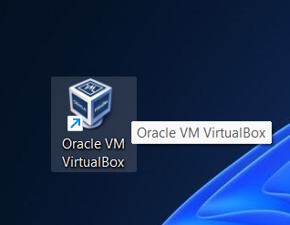
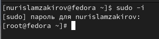
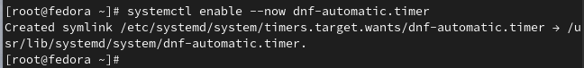
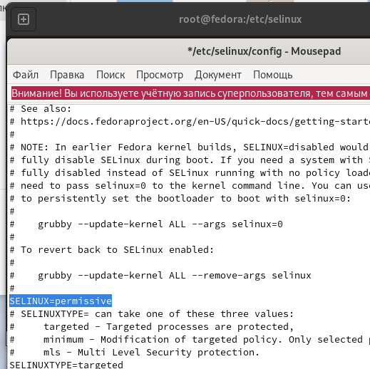
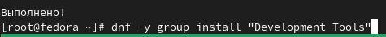
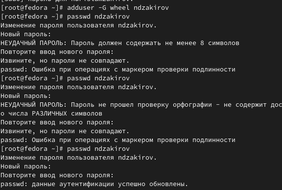
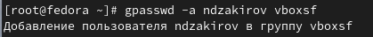
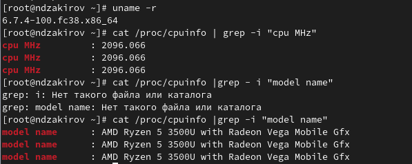

---
## Front matter
title: "Отчет по лабораторной работе №1"
subtitle: "Операционные системы"
author: "Закиров Нурислам Дамирович"

## Generic otions
lang: ru-RU
toc-title: "Содержание"

## Bibliography
bibliography: bib/cite.bib
csl: pandoc/csl/gost-r-7-0-5-2008-numeric.csl

## Pdf output format
toc: true # Table of contents
toc-depth: 2
lof: true # List of figures
lot: true # List of tables
fontsize: 12pt
linestretch: 1.5
papersize: a4
documentclass: scrreprt
## I18n polyglossia
polyglossia-lang:
  name: russian
  options:
	- spelling=modern
	- babelshorthands=true
polyglossia-otherlangs:
  name: english
## I18n babel
babel-lang: russian
babel-otherlangs: english
## Fonts
mainfont: PT Serif
romanfont: PT Serif
sansfont: PT Sans
monofont: PT Mono
mainfontoptions: Ligatures=TeX
romanfontoptions: Ligatures=TeX
sansfontoptions: Ligatures=TeX,Scale=MatchLowercase
monofontoptions: Scale=MatchLowercase,Scale=0.9
## Biblatex
biblatex: true
biblio-style: "gost-numeric"
biblatexoptions:
  - parentracker=true
  - backend=biber
  - hyperref=auto
  - language=auto
  - autolang=other*
  - citestyle=gost-numeric
## Pandoc-crossref LaTeX customization
figureTitle: "Рис."
tableTitle: "Таблица"
listingTitle: "Листинг"
lofTitle: "Список иллюстраций"
lotTitle: "Список таблиц"
lolTitle: "Листинги"
## Misc options
indent: true
header-includes:
  - \usepackage{indentfirst}
  - \usepackage{float} # keep figures where there are in the text
  - \floatplacement{figure}{H} # keep figures where there are in the text
---

# Цель работы

Целью данной работы является приобретение практических навыков установки операционной системы на виртуальную машину, настройки минимально необходимых для дальнейшей работы сервисов.

# Задание

1. Создание виртуальной машины
2. Работа с операционной системой после установки
3. Установка имени пользователя и названия хоста
4. Дополнительные задания

# Выполнение лабораторной работы

## Создание виртуальной машины

Качаем установщик VirtualBox c официального сайта и устанавливаем данную программу на персональный компьютер. У меня виртуальная машина уже была установленна, поэтому данный этап уже выполнен(рис. @fig:001).

{#fig:001 width=70#%}

## Работа с операционной системой после установки

Устанавливаем операционную систему, в нашем случае это fedora. Для этого качаем с браузера ОС в образе диска, после чего производим установку fedora на нашу виртуальную машину. Данный этап у меня тоже был выполнен до лаболаторной работы. (рис. @fig:002).

{#fig:002 width=70%}

Следующим этапом мы запускаем терминал при помощи комбинацию клавиш Win+Enter и переключаемся на роль супер-пользователя(рис. @fig:003).

{#fig:003 width=70%}

Устанавливаем средство pandoc для работы с языком разметки Markdown и дистрибутив TexLive, но так как до начала лаболаторной работы всё было установленно, данный этап был пропущен. Поэтому только обновляем все пакеты при помощи dnf -y update (рис. @fig:004).

{#fig:004 width=70%}

Устанавливаем программы для удобства работы в консоли при помощи dnf install dnf-automatic(рис. @fig:005).

{#fig:005 width=70%}

Следующим шагом мы запускаем таймер при помощи команды systemctl enable --now dnf-automatic.timer(рис. @fig:006).

{#fig:006 width=70%}

Открываем файл congig при помощи текстового редактора mousepad (рис. @fig:007).

{#fig:007 width=70%}

В открывшимся файле изменяем заначение SELINUX=enforcing на значение SELINUX=permissive (рис. @fig:008).

{#fig:008 width=70%}

Запускаем терминальный мультиплексор tmux, переключаемся на роль супер-пользователя и установливаем средства разработки и пакет DKMS, после чего перезапускаем виртуальну машину при помощи reboot(рис. @fig:009).

{#fig:009 width=70%}

## Установка имени пользователя и названия хоста

Запускаем терминальный мультиплексор tmux, создаем пользователя, задавая свой логин, после чего задаем свой пароль(рис. @fig:010).

{#fig:010 width=70%}

Следующим этапом устанавливем имя хоста и проводим проверку при помощи hostnamectl(рис. @fig:011).

{#fig:011 width=70%}

Внутри виртуальной машины добавляем своего пользователя в группу vboxsf(рис. @fig:012).

{#fig:012 width=70%}

# Выводы

При выполнении данной лабораторной работы я приобрел практические навыки установки операционной системы на виртуальную машину и настройки минимально необходимых для дальнейшей работы сервисов.

# Ответы на контрольные вопросы

1. Учетная запись содержит необходимые для идентификации пользователя при подключении к системе данные, а так же информацию для авторизации и учета: системного имени (user name) (оно может содержать только латинские буквы и знак нижнее подчеркивание, еще оно должно быть уникальным), идентификатор пользователя (UID) (уникальный идентификатор пользователя в системе, целое положительное число), идентификатор группы (CID) (группа, к к-рой относится пользователь. Она, как минимум, одна, по умолчанию - одна), полное имя (full name) (Могут быть ФИО), домашний каталог (home directory) (каталог, в к-рый попадает пользователь после входа в систему и в к-ром хранятся его данные), начальная оболочка (login shell) (командная оболочка, к-рая запускается при входе в систему).

2. Для получения справки по команде: <команда> --help; для перемещения по файловой системе - cd; для просмотра содержимого каталога - ls; для определения объёма каталога - du <имя каталога>; для создания / удаления каталогов - mkdir/rmdir; для создания / удаления файлов - touch/rm; для задания определённых прав на файл / каталог - chmod; для просмотра истории команд - history

3. Файловая система - это порядок, определяющий способ организации и хранения и именования данных на различных носителях информации. Примеры: FAT32 представляет собой пространство, разделенное на три части: олна область для служебных структур, форма указателей в виде таблиц и зона для хранения самих файлов. ext3/ext4 - журналируемая файловая система, используемая в основном в ОС с ядром Linux.

4. С помощью команды df, введя ее в терминале. Это утилита, которая показывает список всех файловых систем по именам устройств, сообщает их размер и данные о памяти. Также посмотреть подмонтированные файловые системы можно с помощью утилиты mount.

5. Чтобы удалить зависший процесс, вначале мы должны узнать, какой у него id: используем команду ps. Далее в терминале вводим команду kill < id процесса >. Или можно использовать утилиту killall, что "убьет" все процессы, которые есть в данный момент, для этого не нужно знать id процесса.

# Выполнение дополнительного задания

Получаем инфорамции о версии ядра Linux, частоте процессора, а также модели процессора(рис. @fig:013).

{#fig:013 width=70%}

Получаем инфорамции о объёме доступной оперативной памяти, типе обнаруженного гипервизора, типе файловой системы корневого раздела, а также о последовательности монтирования файловых систем(рис. @fig:014).

{#fig:014 width=70%}

# Список литературы

1. Dash P. Getting started with oracle vm virtualbox. Packt Publishing Ltd, 2013. 86 p.
2. Colvin H. Virtualbox: An ultimate guide book on virtualization with virtualbox. CreateSpace Independent Publishing Platform, 2015. 70 p.
3. van Vugt S. Red hat rhcsa/rhce 7 cert guide : Red hat enterprise linux 7 (ex200 and ex300). Pearson IT Certification, 2016. 1008 p.
4. Робачевский А., Немнюгин С., Стесик О. Операционная система unix. 2-е изд. Санкт-Петербург: БХВ-Петербург, 2010. 656 p.
5. Немет Э. et al. Unix и Linux: руководство системного администратора. 4-е изд. Вильямс, 2014. 1312 p.
6. Колисниченко Д.Н. Самоучитель системного администратора Linux. СПб.: БХВ-Петербург, 2011. 544 p.
7. Robbins A. Bash pocket reference. O’Reilly Media, 2016. 156 p.

