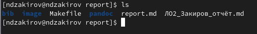
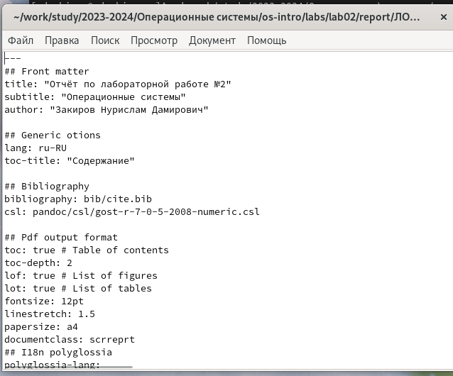
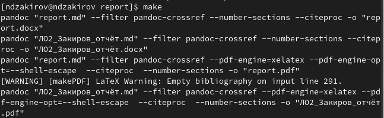

---
## Front matter
lang: ru-RU
title: Лабораторная работа 3
subtitle: Операционные системы
author:
  - Закиров Н.Д., НКАбд-03-23
institute:
  - Российский университет дружбы народов, Москва, Россия
date: 27 февраля 2024

## i18n babel
babel-lang: russian
babel-otherlangs: english

## Formatting pdf
toc: false
toc-title: Содержание
slide_level: 2
aspectratio: 169
section-titles: true
theme: metropolis
header-includes:
 - \metroset{progressbar=frametitle,sectionpage=progressbar,numbering=fraction}
 - '\makeatletter'
 - '\beamer@ignorenonframefalse'
 - '\makeatother'
## Fonts
mainfont: PT Serif
romanfont: PT Serif
sansfont: PT Sans
monofont: PT Mono
mainfontoptions: Ligatures=TeX
romanfontoptions: Ligatures=TeX
sansfontoptions: Ligatures=TeX,Scale=MatchLowercase
monofontoptions: Scale=MatchLowercase,Scale=0.9
---

# Информация

## Докладчик

:::::::::::::: {.columns align=center}
::: {.column width="70%"}

  * Закиров Нурислам Дамирович
  * Студент 1 курса
  * Группа: НКАбд-03-23
  * Российский университет дружбы народов
 
:::
::::::::::::::

# Лабораторная работа

## Цель работы

Цель данной лабораторной работы - научиться оформлять отчёты с помощью легковесного языка разметки Markdown.

# Задание

- Сделайте отчёт по предыдущей лабораторной работе в формате Markdown.
- В качестве отчёта предоставляются отчёты в 3 форматах: pdf, docx и md.

## Выполнение лабораторной работы

Переходим в каталог по отчёту нашей лабораторной работы при помощи cd (рис. 1).

{#fig:001 width=60%}

## Выполнение лабораторной работы

После того, как заблаговременно создали файл в формате MarkDown для отчёта по лабораторной работе, проверяем его наличие при помощи ls (рис. 2).

{#fig:002 width=60%}

## Выполнение лабораторной работы

Далее мы открываем данный файл при помощи фоторедактора mousepad(рис. 3).

{#fig:003 width=60%}

## Выполнение лабораторной работы

После чего мы оформляем сам отчёт(рис. 4).

{#fig:004 width=45%}

## Выполнение лабораторной работы

Следующим этапом сохраняем наши изменения и при помощи make компилируем данный отчёт в форматы pdf и docx(рис. 5).

{#fig:005 width=50%}

## Выполнение лабораторной работы

Проверяем правильность компилируемости при помощи ls(рис. 6).

{#fig:006 width=60%}

## Выполнение лабораторной работы

Так же, запускаем отчёт в формате pdf, чтобы убедиться, что программа сработала без ошибок(рис. 7).

{#fig:007 width=45%}

## Выводы

В ходе данной лаболаторной работы я научился оформлять отчёты с помощью легковесного языка разметки Markdown.
