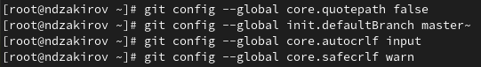
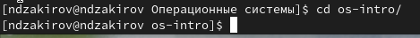
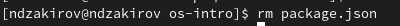
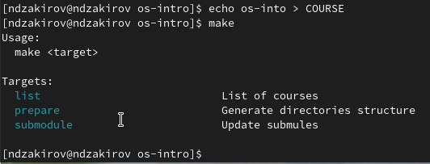

---
## Front matter
title: "Отчёт по лабораторной работе №4"
subtitle: "Операционные системы"
author: "Закиров Нурислам Дамирович"

## Generic otions
lang: ru-RU
toc-title: "Содержание"

## Bibliography
bibliography: bib/cite.bib
csl: pandoc/csl/gost-r-7-0-5-2008-numeric.csl

## Pdf output format
toc: true # Table of contents
toc-depth: 2
lof: true # List of figures
lot: true # List of tables
fontsize: 12pt
linestretch: 1.5
papersize: a4
documentclass: scrreprt
## I18n polyglossia
polyglossia-lang:
  name: russian
  options:
	- spelling=modern
	- babelshorthands=true
polyglossia-otherlangs:
  name: english
## I18n babel
babel-lang: russian
babel-otherlangs: english
## Fonts
mainfont: PT Serif
romanfont: PT Serif
sansfont: PT Sans
monofont: PT Mono
mainfontoptions: Ligatures=TeX
romanfontoptions: Ligatures=TeX
sansfontoptions: Ligatures=TeX,Scale=MatchLowercase
monofontoptions: Scale=MatchLowercase,Scale=0.9
## Biblatex
biblatex: true
biblio-style: "gost-numeric"
biblatexoptions:
  - parentracker=true
  - backend=biber
  - hyperref=auto
  - language=auto
  - autolang=other*
  - citestyle=gost-numeric
## Pandoc-crossref LaTeX customization
figureTitle: "Рис."
tableTitle: "Таблица"
listingTitle: "Листинг"
lofTitle: "Список иллюстраций"
lotTitle: "Список таблиц"
lolTitle: "Листинги"
## Misc options
indent: true
header-includes:
  - \usepackage{indentfirst}
  - \usepackage{float} # keep figures where there are in the text
  - \floatplacement{figure}{H} # keep figures where there are in the text
---

# Цель работы

Целью данной лаболаторной работы является изучение идеологии и применение средств контроля версий и приобретение знаний по работе с git.

# Задание

1. Заргеистрироваться на GitHub
2. Создать базовую конфигурацию для работы с git
3. Создать ключ SSH
4. Создать ключ GPG
5. Настроить подписи Git
6. Создать локальный каталог для выполнения заданий по предмету.

# Выполнение лабораторной работы

## Установка программного обеспечения

Заранее регистрация в git уже была успешно выполнена, поэтому сразу переходим к следующим этапам. Устанавливаем git при помощи dnf install git и устанавливаем gh при помощи dnf install gh(рис. @fig:001).

{#fig:001 width=70%}

## Базовая настройка git

Далее настраиваем верификацию и подписание коммитов git, зададаем имя начальной ветки master, параметр autocrlf и safecrlf(рис. @fig:002).

{#fig:002 width=70%}

## Создание ключа SSH

Создаем ключ ssh по алгоритму rsa с ключём размером 4096 бит и по алгоритму ed25519 (рис. @fig:003).

{#fig:003 width=70%}

Следующим этапом мы генерируем ключ pgp выбирая слудеющие опции:тип RSA and RSA, размер 4096, срок действия неограниченный (рис. @fig:004).

## Создание ключа GPG

{#fig:004 width=70%}

После чего, мы копируем данный нам ключ командой gpg --armor --export <PGP Fingerprint> | xclip -sel clip в буфер обмена, где вместо "PGP Fingerprint" вставляем данные занчения.(рис. @fig:005).

{#fig:005 width=70%}

Теперь вставляем данный ключ при помощи комбинации Ctrl+V на официальном сайте GitHub в настройках GitHub, нажав на кнопку New GPG key(рис. @fig:006).

{#fig:006 width=70%}

Ключ успешно привязался(рис. @fig:007).

{#fig:007 width=70%}

## Настроить подписи Git

Cледующим этапом мы используем введёный email и указываем Git применять его при подписи коммитов (рис. @fig:008).

{#fig:008 width=70%}

## Настройка gh

Даллее мы авторизируемся в терминале через команду gh auth login. Отвечаем на все наводящие вопросы(рис. @fig:009).

{#fig:009 width=70%}

После входим в свой аккаунт GitHub через браузер(рис. @fig:010).

{#fig:010 width=70%}

После авторизации, Git просит ввести код, который мы заранее скопировали с терминала и вставили бразуре, после чего мы успешно авторизовались(рис. @fig:011).

{#fig:011 width=70%}

В терминале также подтвержается наша авторизация(рис. @fig:012).

{#fig:012 width=70%}

## Создание шаблона для рабочего пространства

Далее нам необходимо создать шаблон рабочего пространства. При промощи mkdir -p ~/work/study/2023-2024/"Операционные системы" мы создаем каталог, после чего переходим в нее. Создаем шаблон при помощи gh repo create(рис. @fig:013).

{#fig:013 width=70%}

После чего мы клониуем репозиторий курса на нашу систему при помощи git clone(рис. @fig:014).

{#fig:014 width=70%}

## Настройка каталога курса

Переходим в созданную папку os-intro при помощи cd(рис. @fig:015).

{#fig:015 width=70%}

Удаляем лишние файлы при помощи rm (рис. @fig:016).

{#fig:016 width=70%}

Создаем необходимые каталоги при помощи echo и make(рис. @fig:017).

{#fig:017 width=70%}

Отправляем файлы на сервер GitHub при помощи git add, git commit и git push(рис. @fig:018).

{#fig:018 width=70%}

# Выводы

В ходе данной лабораторной работы я изучил идеологии и применения средств контроля версий, а также приобрел знания по работе с git.

# Ответы на контрольные вопросы.

1. Системы контроля версий (VCS) - программное обеспечение для облегчения работы с изменяющейся информацией. 
Они позволяют хранить несколько версий изменяющейся информации, 
одного и того же документа, может предоставить доступ к более ранним версиям документа. 
Используется для работы нескольких человек над проектом, позволяет посмотреть, кто и 
когда внес какое-либо изменение и т. д. VCS ррименяются для: Хранения понлой истории изменений, 
сохранения причин всех изменений, поиска причин изменений и совершивших изменение, совместной работы над проектами.

2. Хранилище -- репозиторий, хранилище версий, в нем хранятся все документы, включая историю их изменения и прочей служебной информацией. 
commit -- отслеживание изменений, сохраняет разницу в изменениях.
История -- хранит все изменения в проекте и позволяет при необходимости вернуться/обратиться к нужным данным.
Рабочая копия -- копия проекта, основанная на версии из хранилища, чаще всего последней версии.

3. Централизованные VCS (например: CVS, TFS, AccuRev) -- одно основное хранилище всего проекта. Каждый пользователь копирует себе
необходимые ему файлы из этого репозитория, изменяет, затем добавляет изменения обратно в хранилище. Децентрализованные
VCS (например: Git, Bazaar) -- у каждого пользователя свой вариант репозитория (возможно несколько вариантов), есть возможность добавлять
и забирать изменения из любого репозитория. В отличие от классических, в распределенных (децентралиованных)
системах контроля версий центральный репозиторий не является обязательным.

4. Сначала создается и подключается удаленный репозиторий, затем по мере изменения проекта эти изменения отправляются на сервер.

5. Участник проекта перед началом работы получает нужную ему версию проекта в хранилище, с помощью определенных команд, после внесения изменений пользователь размещает новую версию в хранилище. При этом предыдущие версии не удаляются. К ним можно вернуться в любой момент.

6. Хранение информации о всех изменениях в вашем коде, обеспечение удобства командной работы над кодом.

7. Создание основного дерева репозитория: git init

Получение обновлений (изменений) текущего дерева из центрального репозитория: git pull

Отправка всех произведённых изменений локального дерева в центральный репозиторий: git push

Просмотр списка изменённых файлов в текущей директории: git status

Просмотр текущих изменений: git diff

Сохранение текущих изменений: добавить все изменённые и/или созданные файлы и/или каталоги: git add .

добавить конкретные изменённые и/или созданные файлы и/или каталоги: git add имена_файлов

удалить файл и/или каталог из индекса репозитория (при этом файл и/или каталог остаётся в локальной директории): git rm имена_файлов

Сохранение добавленных изменений:

сохранить все добавленные изменения и все изменённые файлы: git commit -am 'Описание коммита'

сохранить добавленные изменения с внесением комментария через встроенный редактор: git commit

создание новой ветки, базирующейся на текущей: git checkout -b имя_ветки

переключение на некоторую ветку: git checkout имя_ветки (при переключении на ветку, которой ещё нет в локальном репозитории, она будет создана и связана с удалённой)

отправка изменений конкретной ветки в центральный репозиторий: git push origin имя_ветки

слияние ветки с текущим деревом: git merge --no-ff имя_ветки

Удаление ветки:

удаление локальной уже слитой с основным деревом ветки: git branch -d имя_ветки

принудительное удаление локальной ветки: git branch -D имя_ветки

удаление ветки с центрального репозитория: git push origin :имя_ветки

8. git push -all отправляем из локального репозитория все сохраненные изменения в центральный репозиторий, предварительно создав локальный репозиторий и сделав предварительную конфигурацию.

9. Ветвление - один из параллельных участков в одном хранилище, исходящих из одной версии, обычно есть главная ветка. 
Между ветками, т. е. их концами возможно их слияние. Используются для разработки новых функций.

10. Во время работы над проектом могут создаваться файлы, которые не следуют добавлять в репозиторий. Например, временные файлы.
Можно прописать шаблоны игнорируемых при добавлении в репозиторий типов файлов в файл .gitignore с помощью сервисов.

# Список литературы{.unnumbered}

1. Лабораторная работа № 2 [Электронный ресурс] URL: https://esystem.rudn.ru/mod/page/view.php?id=970819

