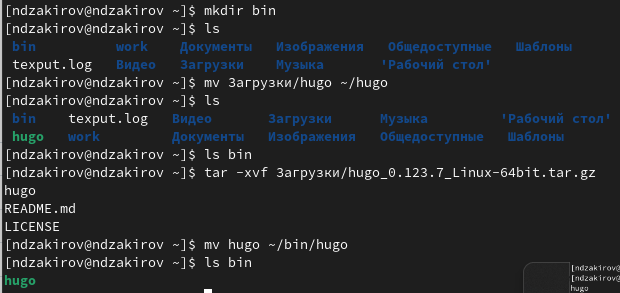
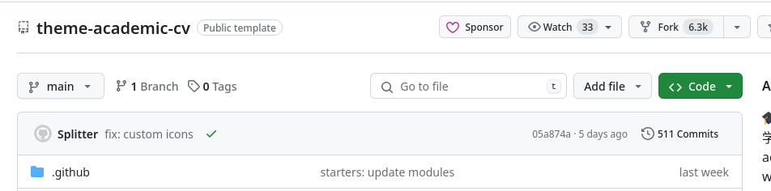
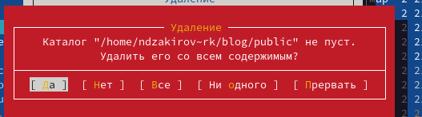
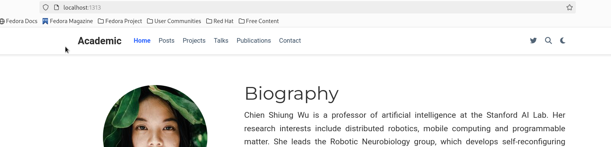
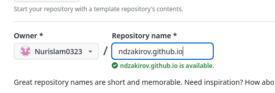
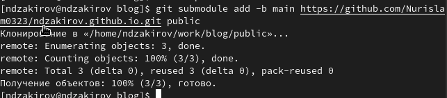
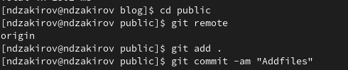

---
## Front matter
lang: ru-RU
title: Этап индивидуального проекта №1
subtitle: Операционные системы
author:
  - Закиров Н.Д., НКАбд-03-23
institute:
  - Российский университет дружбы народов, Москва, Россия
date: 2 марта 2024

## i18n babel
babel-lang: russian
babel-otherlangs: english

## Formatting pdf
toc: false
toc-title: Содержание
slide_level: 2
aspectratio: 169
section-titles: true
theme: metropolis
header-includes:
 - \metroset{progressbar=frametitle,sectionpage=progressbar,numbering=fraction}
 - '\makeatletter'
 - '\beamer@ignorenonframefalse'
 - '\makeatother'
## Fonts
mainfont: PT Serif
romanfont: PT Serif
sansfont: PT Sans
monofont: PT Mono
mainfontoptions: Ligatures=TeX
romanfontoptions: Ligatures=TeX
sansfontoptions: Ligatures=TeX,Scale=MatchLowercase
monofontoptions: Scale=MatchLowercase,Scale=0.9
---

# Информация

## Докладчик

:::::::::::::: {.columns align=center}
::: {.column width="70%"}

  * Закиров Нурислам Дамирович
  * Студент 1 курса
  * Группа: НКАбд-03-23
  * Российский университет дружбы народов
 
:::
::::::::::::::

# Лабораторная работа

## Цель работы

Целью данной лабораторной работы является научиться размещать сайт на Github pages. Выполнить первый этап реализации индивидуального проекта.

# Задание

- Установить необходимое ПО
- Скачать шаблон темы сайта
- Разместить его на хостинге Git
- Установить параметр для URLs сайта
- Разместить заготовку сайта на Github pages.

# Выполнение этапа индивидуального проекта

## Установка необходимого ПО

Скачиваю последнюю версию исполняемого файла hugo для своей операционной системы (рис. 1).

{#fig:001 width=55%}

## Установка необходимого ПО

Распаковываю архив с исполняемым файлом (рис. 2).

{#fig:002 width=55%}

## Установка необходимого ПО

Создаю в домашнем каталоге пустую папку bin с помощью утилиты mkdir, переношу в эту папку исполняемый файл hugo (рис. 3).

{#fig:003 width=55%}

## Скачивание шаблона темы сайта

Открываю репозиторий с шаблоном темы сайта (рис. 4).

{#fig:004 width=55%}

## Скачивание шаблона темы сайта

Создаю свой репозиторий blog на основе репозитория с шаблоном темы сайта (рис. 5).

{#fig:005 width=55%}

## Скачивание шаблона темы сайта

Клонирую созданный репозиторий к себе в локальный репозиторий (рис. 6).

{#fig:006 width=55%}

## Размещение его на хостинге Git

Запускаю исполняемый файл (рис. 7).

{#fig:007 width=55%}

## Размещение его на хостинге Git

Удаляю папку public которая сейчас нам не понадобится, тем более мы создадим свою (рис. 8).

{#fig:008 width=55%}

## Размещение его на хостинге Git

Снова запускаю исполняемый файл с командой server (рис. 9).

{#fig:009 width=55%}

## Размещение его на хостинге Git

Получилась страничка сайта на локальном сервере (рис. 10).

{#fig:010 width=55%}

## Установка параметр для URLs сайта

Теперь создаю новый пустой репозиторий чье имя будет адресом сайта (рис. 11).

{#fig:011 width=55%}

## Установка параметр для URLs сайта

Клонирую созданный репозиторий, чтобы создать локальный репозиторий у себя на компьютере (рис. 12).

{#fig:012 width=55%}

## Установка параметр для URLs сайта

Создаю главную ветку с именем main (рис. 13).

{#fig:013 width=55%}

## Установка параметр для URLs сайта

Создаю пустой файл README.md и отправляю изменения на глобальный репозиторий, чтобы его активировать (рис. 14).

{#fig:014 width=55%}

## Установка параметр для URLs сайта

Подключаю репозиторий к каталогу public (рис. 15).

{#fig:016 width=55%}

## Установка параметр для URLs сайта

Снова выполняю команду исполняемого файла, чтобы заполнить создавшийся каталог public (рис. 16).

{#fig:017 width=55%}

## Размещение заготовку сайта на Github pages.

Проверяю есть ли подключение между public и репозиторием evdvorkina.github.io, после чего отправляю изменения на глобальный репозиторий (рис. 17).

{#fig:018 width=55%}

## Выводы

Я научился размещать сайт на Github pages и, следовательно, выполнил первый этап реализации индивидуального проекта.
